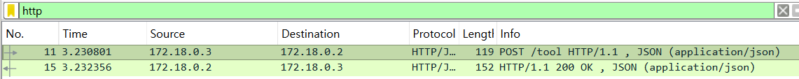
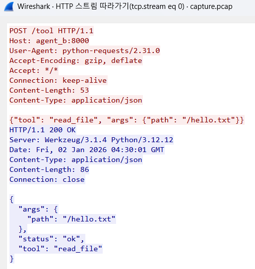

# Week 1: Agent HTTP 통신 및 패킷 분석

Docker 환경에서 Agent 간 HTTP 통신을 구현하고, Wireshark로 네트워크 패킷을 분석하는 실습입니다.

## 목표

- Docker Compose를 사용한 멀티 컨테이너 환경 구축
- Agent A (Client)와 Agent B (Server) 간 JSON 기반 HTTP 통신 구현
- Wireshark를 통한 네트워크 패킷 수준 통신 검증

## 프로젝트 구조

```
week1/
├── agent_a/
│   ├── agent_a.py          # HTTP Client
│   ├── Dockerfile
│   └── requirements.txt
├── agent_b/
│   ├── tool_server.py      # Flask Server
│   ├── Dockerfile
│   └── requirements.txt
├── docker-compose.yml
├── capture.pcap            # 캡처된 패킷 파일
└── README.md
```

## 실행 방법

### 1. 환경 요구사항

- Docker Desktop
- Wireshark (패킷 분석용)

### 2. Agent 실행

```bash
# 프로젝트 디렉토리로 이동
cd week1

# Docker Compose로 빌드 및 실행
docker-compose up --build
```

### 3. 패킷 캡처

**터미널 1:**

```bash
# Agent B와 네트워크를 공유하는 tcpdump 컨테이너 실행
docker run --name tcpdump-capture --net=container:agent_b kaazing/tcpdump -w /tmp/capture.pcap
```

**터미널 2:**

```bash
# Agent A 실행하여 트래픽 발생
docker-compose run agent_a
```

**터미널 1로 돌아가서 Ctrl+C로 캡처 종료 후:**

```bash
# 캡처 파일 추출
docker cp tcpdump-capture:/tmp/capture.pcap ./capture.pcap

# 컨테이너 정리
docker rm tcpdump-capture
```

### 4. Wireshark 분석

1. Wireshark 실행
2. `capture.pcap` 파일 열기
3. 필터 적용: `http`
4. POST /tool 패킷 확인
5. 우클릭 → Follow → HTTP Stream으로 JSON 확인

## 실행 결과

### 1. Agent 로그 (JSON 통신 확인)

```
agent_b  | INFO:__main__:받은 요청: tool='read_file' args={'path': '/hello.txt'}
agent_a  | INFO:__main__:요청 전송: tool='read_file' args={'path': '/hello.txt'}
agent_a  | INFO:__main__:서버 응답: {'status': 'ok', 'tool': 'read_file', 'args': {'path': '/hello.txt'}}
agent_a  | INFO:__main__:작업 완료
```

### 2. Wireshark 패킷 캡처

#### POST /tool 패킷 확인



#### Follow HTTP Stream (JSON Payload)



**캡처된 내용:**

```http
POST /tool HTTP/1.1
Host: agent_b:8000
Content-Type: application/json

{"tool": "read_file", "args": {"path": "/hello.txt"}}

HTTP/1.1 200 OK
Content-Type: application/json

{"status": "ok", "tool": "read_file", "args": {"path": "/hello.txt"}}
```

## 주요 코드

### Agent B (Server)

```python
@app.route('/tool', methods=['POST'])
def handle_tool():
    data = request.get_json()
    logger.info(f"받은 요청: tool='{data.get('tool')}' args={data.get('args')}")

    response = {
        'status': 'ok',
        'tool': data.get('tool'),
        'args': data.get('args')
    }
    return jsonify(response), 200
```

### Agent A (Client)

```python
url = "http://agent_b:8000/tool"
payload = {
    "tool": "read_file",
    "args": {"path": "/hello.txt"}
}
response = requests.post(url, json=payload, timeout=5)
```

## 학습 내용

### 1. Docker 네트워크

- 컨테이너 간 통신은 독립된 가상 네트워크에서 발생
- 컨테이너 이름을 DNS처럼 사용 가능 (`agent_b:8000`)

### 2. 패킷 캡처 방법

- Windows에서는 Docker 내부 트래픽을 직접 캡처 불가
- `--net=container:` 옵션으로 네트워크 네임스페이스 공유 필요
- 컨테이너 유지(`--rm` 제거)가 파일 추출의 핵심

### 3. HTTP 보안 취약점

- 평문 HTTP는 모든 데이터가 노출됨
- JSON payload, 헤더 정보 모두 가시화
- MITM 공격에 취약함을 확인

## 트러블슈팅

### 문제: 패킷 파일이 0 바이트

- **원인**: `--rm` 옵션으로 컨테이너 자동 삭제
- **해결**: `--name`으로 컨테이너 이름 지정 후 파일 추출

### 문제: Wireshark에서 패킷 안 보임

- **원인**: Docker 내부 네트워크는 호스트에서 감시 불가
- **해결**: tcpdump로 내부에서 직접 캡처 후 분석
