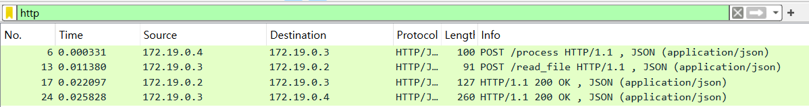
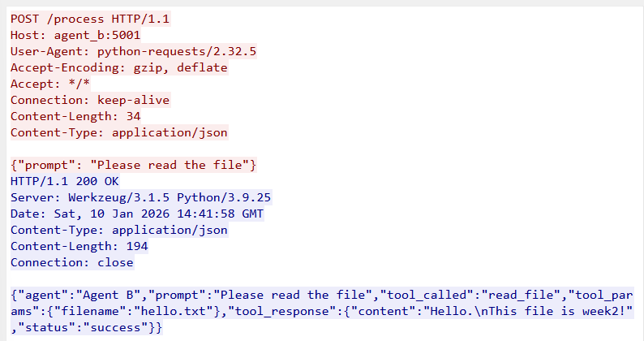
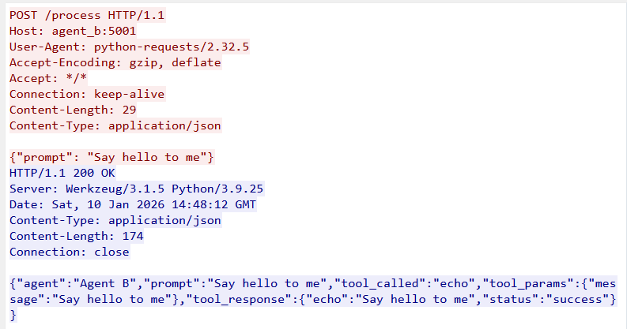

# Week 2: Multi-Agent MITM Threat Analysis

[Week 2: Multi-Agent MITM 위협 분석 - 티스토리](https://odongdong.tistory.com/123)

멀티 에이전트 구조에서 에이전트 간 HTTP 평문 통신을 관찰하고,
에이전트의 내부 처리 과정(prompt / tool-call / response)이 네트워크 메시지로 어떻게 노출되는지 확인하는 실습입니다.

## 목표

- **멀티 에이전트 구조**에서 에이전트 간 HTTP 평문 통신 관찰
- Agent 내부 처리 흐름과 네트워크 메시지의 대응 관계 이해
- HTTP payload 내 JSON 필드 의미 분석
- Prompt 변경에 따른 tool-call 변화 관찰

## 프로젝트 구조

```
week2/
├── agent_a/
│   ├── agent_a.py          # Requester
│   └── Dockerfile
├── agent_b/
│   ├── agent_b.py          # Processor
│   └── Dockerfile
├── tool_server/
│   ├── tool_server.py      # Executor
│   └── Dockerfile
├── data/
│   └── hello.txt           # 읽기 테스트용 파일
├── docker-compose.yml
├── capture.pcap            # 실험 1 캡처 파일
├── capture2.pcap           # 실험 2 캡처 파일
└── README.md
```

### 컴포넌트 역할

- **Agent A**: 환경변수로 PROMPT를 받아 Agent B에게 전달
- **Agent B**: Prompt를 분석하여 규칙 기반으로 tool 선택
  - `'file'` 키워드 포함 → `read_file` 호출
  - 그 외 → `echo` 호출
- **Tool Server**: Agent B의 요청에 따라 파일 읽기 또는 메시지 반환

## 실행 방법

### 1. 환경 요구사항

- Docker Desktop
- Wireshark (패킷 분석용)

### 2. Agent 실행

```bash
# 프로젝트 디렉토리로 이동
cd week2

# Docker Compose로 빌드 및 실행
docker-compose up --build
```

### 3. 패킷 캡처

**터미널 1:**

```bash
# 기존 컨테이너 정리
docker-compose down
docker rm -f tcpdump-capture

# Tool Server와 Agent B만 백그라운드로 실행
docker-compose up -d tool_server agent_b

# tcpdump 실행 (Agent B와 네트워크 공유)
docker run --name tcpdump-capture --net=container:agent_b kaazing/tcpdump -w /tmp/capture.pcap port 5001 or port 5002
```

**터미널 2:**

```bash
# Agent A 실행하여 트래픽 발생
docker-compose run agent_a
```

**터미널 1로 돌아가서 Ctrl+C로 캡처 종료 후:**

```bash
# 캡처 파일 추출
docker cp tcpdump-capture:/tmp/capture.pcap ./capture.pcap

# 파일 확인
dir capture.pcap  # Windows
ls -lh capture.pcap  # Mac/Linux

# 컨테이너 정리
docker rm tcpdump-capture
docker-compose down
```

### 4. Wireshark 분석

1. Wireshark 실행
2. `capture.pcap` 파일 열기
3. 필터 적용: `http`
4. `POST /process` 패킷 우클릭 → Follow → HTTP Stream
5. JSON payload 확인

## 실행 결과

### 1. Agent 로그

```
tool_server  |  * Running on http://172.19.0.2:5002
agent_b      |  * Running on http://172.19.0.3:5001
agent_a      | INFO:__main__:[Agent A] PROMPT: Please read the file
agent_a      | INFO:__main__:[Agent A] Agent B에게 요청 전송...
agent_b      | [Agent B] 받은 prompt: Please read the file
agent_b      | [Agent B] 선택된 tool: read_file
tool_server  | 172.19.0.3 - - "POST /read_file HTTP/1.1" 200 -
agent_a      | INFO:__main__:  - Tool 호출: read_file
agent_a      | INFO:__main__:  - Tool 파라미터: {'filename': 'hello.txt'}
agent_a      | INFO:__main__:  - Tool 결과: {'content': 'Hello.\nThis file is week2!', 'status': 'success'}
agent_a exited with code 0
```

### 2. Wireshark 패킷 분석

#### 스크린샷 1: 전체 HTTP 패킷



#### 스크린샷 2: JSON Payload 분석



**요청 (Agent A → Agent B):**

```json
POST /process HTTP/1.1
Host: agent_b:5001
Content-Type: application/json

{"prompt": "Please read the file"}
```

**응답 (Agent B → Agent A):**

```json
{
  "agent": "Agent B",
  "prompt": "Please read the file",
  "tool_called": "read_file",
  "tool_params": { "filename": "hello.txt" },
  "tool_response": {
    "content": "Hello.\nThis file is week2!",
    "status": "success"
  }
}
```

**노출되는 정보:**

- 사용자 입력 (`prompt`)
- Agent의 의사결정 과정 (`tool_called`)
- Tool 호출 파라미터 (`tool_params`)
- **민감한 파일 내용** (`tool_response.content`)

#### 스크린샷 3: Prompt 변경 후 Tool-call 변화

**실험 설정:**

`docker-compose.yml`에서 PROMPT 변경:

```yaml
environment:
  - PROMPT=Say hello to me # 'file' 키워드 없음
```

**결과 비교:**



## 학습 내용

### 1. Prompt → Tool-call → Response 흐름

#### (1) Prompt 단계

- **발생 위치**: Agent A → Agent B
- **네트워크 메시지**: `{"prompt": "Please read the file"}`
- **노출 정보**: 사용자 입력

#### (2) Tool-call 단계

- **발생 위치**: Agent B → Tool Server
- **선택 로직**: 규칙 기반 (`if 'file' in prompt`)
- **네트워크 메시지**: `{"filename": "hello.txt"}` 또는 `{"message": "..."}`
- **노출 정보**: Agent의 의사결정 과정

#### (3) Response 단계

- **발생 위치**: Tool Server → Agent B → Agent A
- **네트워크 메시지**: `{"status": "success", "content": "..."}`
- **노출 정보**: 실행 결과 (파일 내용 등)

### 3. MITM 공격 시나리오

중간자 공격자가 Wireshark로 패킷을 캡처하면:

1. 사용자가 무엇을 요청했는지 확인 가능
2. Agent가 어떤 판단을 내렸는지 확인 가능
3. 어떤 tool이 호출되었는지 확인 가능
4. **민감한 파일 내용 전체 획득 가능**

→ **평문 HTTP는 모든 내부 처리 과정을 네트워크에 노출한다.**
