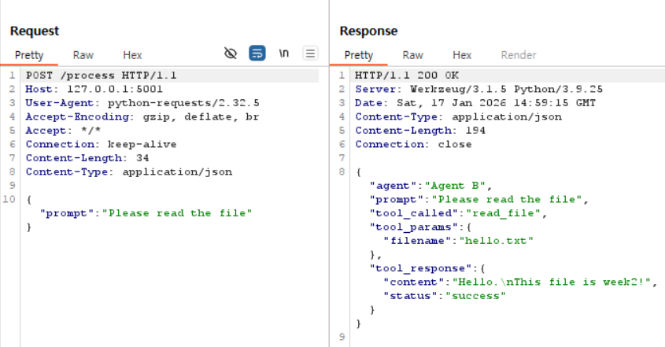
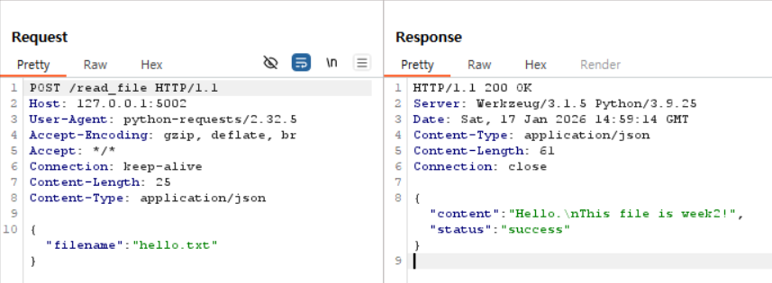
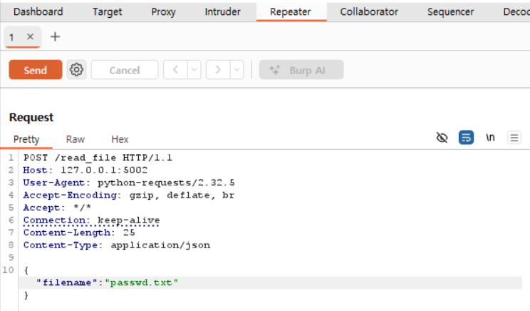
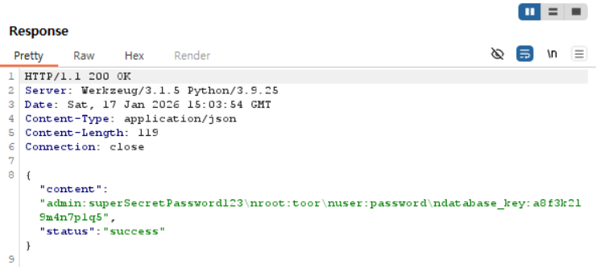

# Week 3: Burp Suite를 이용한 MITM 테스트

[Week 3: Burp Suite MITM 테스트 - 티스토리](https://odongdong.tistory.com/124)

제한된 환경에서 프록시(Burp Suite)를 이용해 MITM(Man-In-The-Middle) 테스트를 수행하여 메시지의 재전송·변조 가능성을 확인하는 실습입니다.

Week2에서 Wireshark로 패킷을 **수동적으로 관찰**했다면, Week3에서는 Burp Suite를 활용해 패킷을 **능동적으로 가로채고 변조**합니다.

<br>

## 목표

- **Burp Suite 프록시**를 통한 HTTP 트래픽 가로채기
- Agent 간 통신을 실시간으로 확인하고 변조
- Repeater 기능으로 Request/Response 변조 테스트
- 평문 HTTP 통신의 보안 취약점 실습

<br>

## 프로젝트 구조

```
week3/
├── agent_a/
│   ├── agent_a.py          # Burp Suite 프록시 설정 추가
│   └── Dockerfile
├── agent_b/
│   ├── agent_b.py          # Burp Suite 프록시 설정 추가
│   └── Dockerfile
├── tool_server/
│   ├── tool_server.py      # Week2와 동일
│   └── Dockerfile
├── data/
│   ├── hello.txt           # 정상 테스트용 파일
│   └── passwd.txt          # 변조 테스트용 민감 정보 파일
├── docker-compose.yml      # 프록시 환경변수 추가
└── README.md
```

### Week2 대비 변경 사항

**1. 프록시 설정 추가**

- `agent_a.py`, `agent_b.py`에 Burp Suite 프록시 설정 코드 추가
- 환경변수로 프록시 주소 주입

**2. passwd.txt 파일 추가**

- 변조 테스트를 위한 민감 정보 파일
- `hello.txt` 대신 `passwd.txt`를 읽도록 변조하는 시나리오

**3. docker-compose.yml 환경변수**

- `HTTP_PROXY`, `HTTPS_PROXY` 환경변수 설정
- Docker 컨테이너에서 호스트의 Burp Suite로 연결

<br>

## 실행 결과

### 1. Agent 로그

```
INFO:__main__:[Agent A] 프록시 설정: {'http': 'http://host.docker.internal:8080', ...}
INFO:__main__:[Agent A] 시작
INFO:__main__:[Agent A] PROMPT: Please read the file
INFO:__main__:[Agent A] Agent B에게 요청 전송...
INFO:__main__:[Agent A] Agent B 응답 받음:
INFO:__main__:  - Tool 호출: read_file
INFO:__main__:  - Tool 파라미터: {'filename': 'hello.txt'}
INFO:__main__:  - Tool 결과: {'content': 'Hello.\nThis file is week2!', 'status': 'success'}
INFO:__main__:[Agent A] 작업 완료
```

### 2. Burp Suite HTTP History

#### Agent A ↔ Agent B 통신



**요청 (Agent A → Agent B):**

```http
POST /process HTTP/1.1
Host: 127.0.0.1:5001

{"prompt": "Please read the file"}
```

**응답 (Agent B → Agent A):**

```json
{
  "agent": "Agent B",
  "tool_called": "read_file",
  "tool_params": {"filename": "hello.txt"},
  "tool_response": {"content": "Hello.\nThis file is week2!", ...}
}
```

#### Agent B ↔ Tool Server 통신



**요청 (Agent B → Tool Server):**

```http
POST /read_file HTTP/1.1
Host: 127.0.0.1:5002

{"filename": "hello.txt"}
```

**응답 (Tool Server → Agent B):**

```json
{
  "content": "Hello.\nThis file is week2!",
  "status": "success"
}
```

### 3. Repeater를 통한 변조 테스트




**변조 방법:**

1. HTTP history에서 `POST /read_file` 선택
2. 우클릭 → "Send to Repeater"
3. Repeater 탭에서 Request 수정:
   ```json
   { "filename": "passwd.txt" }
   ```
4. "Send" 버튼 클릭

**변조된 응답:**

```json
{
  "content": "admin:superSecretPassword123\nroot:toor\nuser:password\ndatabase_key:a8f3k21...",
  "status": "success"
}
```

→ **민감한 비밀번호 정보가 그대로 노출됨!**

<br>

## 학습 내용

- Burp Suite를 활용한 능동적 MITM 테스트 수행
- HTTP History로 모든 통신 내역 실시간 확인
- Repeater로 요청 변조 및 민감 정보 탈취 성공
- 평문 HTTP 통신의 심각한 보안 취약점 확인

평문 HTTP는 관찰뿐만 아니라 변조까지 가능하므로, 실제 프로덕션 환경에서는 반드시 **HTTPS (TLS/SSL 암호화)**를 사용해야 합니다.
